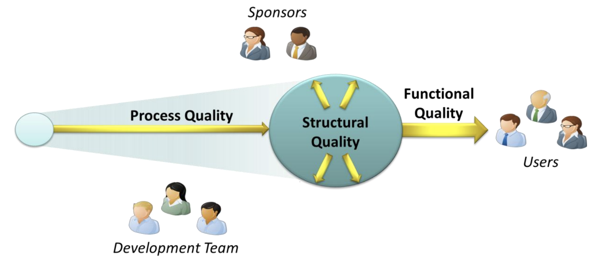

# Introduction to Software Quality

<h2>Victor Martin Garcia</h2>

<a href="mailto:victor.martin.garcia@gmail.com">victor.martin.garcia@gmail.com</a>

------

# Software Quality - who cares?

------

# Defining Quality: Three Factors

------
# Functional quality

* Meeting the specified requirements
	* Project’s sponsors and/or the software’s intended users
	* Compliance with applicable laws and regulations
* Creating software that has few defects
	* Security, functionality
* Good enough performance
* Ease of learning and ease of use

------

# Process quality

* Meeting delivery dates
	* Was the software delivered on time?
* Meeting budgets
	* Was the software delivered for the expected amount of money?
* A repeatable development process that reliably delivers quality software
	* If a process has the first two attributes but so stresses the development team that its best members quit, it isn’t a quality process.
	* True process quality means being consistent from one project to the next.

------

# Not isolated!

* Many connections amongst the 3 aspects of quality

* Positive:
	* Improving the process quality usually will improve functional quality

* Negative:
	* Speeding up the development can improve the process (meeting deadlines, cutting features) but degrade structural and functional quality

------

# Difference of interest 1/2

* Users
	* Care primarly about functional quality
	* Likely to care about some aspects of process quality (delivery date)
	* Users typically don't care at all about structural quality

* Developers
	* Care about structural quality
	* Also care about functional quality
		* Perhaps a bit less than users since cutting features that users want could make life easier for developers
	* Care a lot about process quality, in part because it provides many of the metrics by which they're measured

------

# Difference of interest 2/2

* Sponsors
	* Care about everything!
	* Sponsors are striving to create business value, and the best way to do it is by taking a broad view of software quality

------

# Why bother? 1/2

Safety-critical software in medicine, transportation, nuclear-energy research and industry, aeronautics, military, ...

> _The Role of Software in Recent Catastrophic Accidents_. Wong et al., 2009 [PDF](http://paris.utdallas.edu/reu/document/01-Publications/08-Recent-Catastrophic-Accidents-SSIRI-2010.pdf)

> List of software bugs. Wikipedia. [HTML](https://en.wikipedia.org/wiki/List_of_software_bugs)

------

# Why bother? 2/2

At the XP Day 2009 conference in London, Google’s Mark Striebeck reported on Google’s estimates around the cost of delay in fixing defects:

* $5 to fix a bug immediately after a programmer had introduced it
* $50 if it escaped the programmer’s eyes and was found only after running a full build of the project
* $500 if it was found during an integration test
* $5000 if it managed to find its way to a system test

------

# Motivation

Measuring software quality is motivated by at least two reasons:

* Risk Management
	* Sofware failure has caused more than inconvenience. Software errors have caused human fatalities
	* Causes range from poorly designed user interfaces to direct programming errors
* Cost Management
	* An application with good structural software quality costs less to maintain and is easier to understand and change in response to pressing business needs
	* Poor application structural quality in core business applications results in cost and schedule overruns and creates waste in the form of rework

------

# Desirable properties 1/2

<h2>(CISQ's Quality model)</h2>

* Reliability
	* Measures the level of risk and the likelihood of potential application failures
	* It also measures the defects injected due to modifications made to the software
* Efficiency
	* Especially important for applications in high execution speed environments sudh as algorithmic or transactional processing where performance and scalability are paramount

------

# Desirable properties 1/2

<h2>(CISQ's Quality model)</h2>

* Security
	* A measure of the likelihood of potential security breaches due to poor coding parctices and architecture
	* This quantifies the risk of encountering critical vulnerabilities that damage the business
* Maintainability
	* Adaptability, portability and tranferability (from one development team to another)
* Size
	* It impacts maintainability

------

# Improving software quality 1/2

* Functional quality
	* Testing
		* Manual
		* Automated

* Structural quality
	* Refactoring
	* Static code analysis
	* Profiling

------

# Improving software quality 2/2

* Process quality
	* Methodology
	* Issue tracking
	* Project management
	* Bug tracking

------

# Sources

> _The Three Aspects of Software Quality: Functional, Structual, and Process_. David Chapell. [PDF](http://www.davidchappell.com/writing/white_papers/The_Three_Aspects_of_Software_Quality_v1.0-Chappell.pdf)

> Software Quality. Wikipedia. [HTML](https://en.wikipedia.org/wiki/Software_quality)

> _The Role of Software in Recent Catastrophic Accidents_. Wong et al., 2009. [PDF](http://paris.utdallas.edu/reu/document/01-Publications/08-Recent-Catastrophic-Accidents-SSIRI-2010.pdf)

> List of software bugs. Wikipedia. [HTML](https://en.wikipedia.org/wiki/List_of_software_bugs)

------

# Questions?